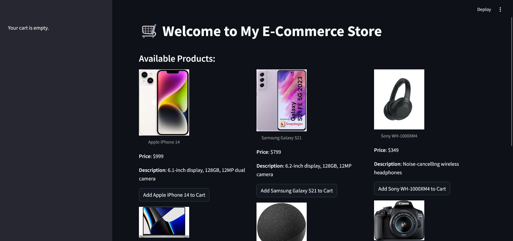
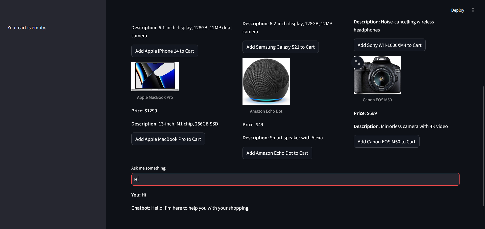
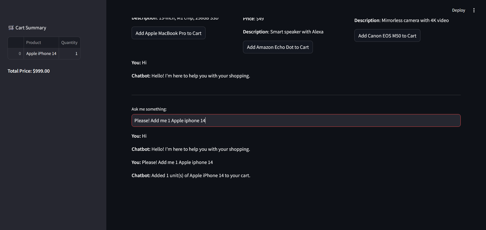
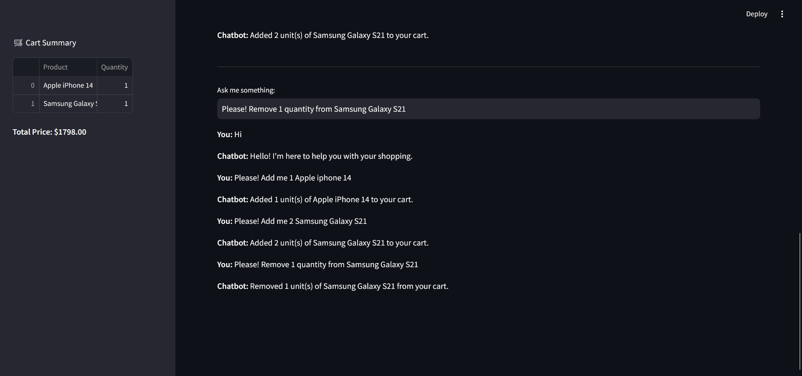
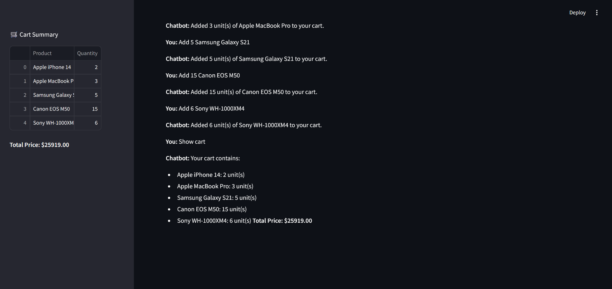
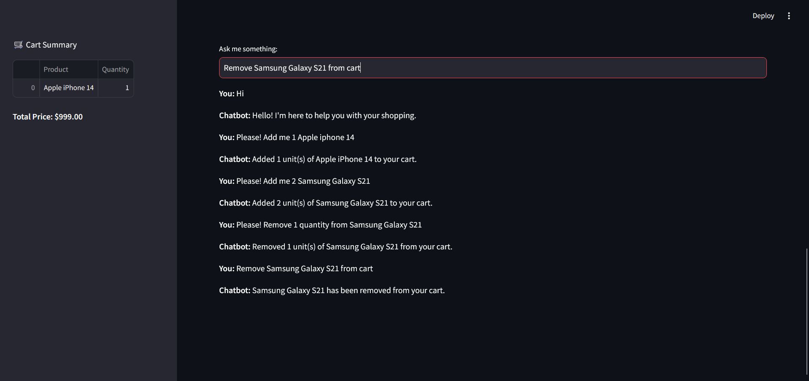
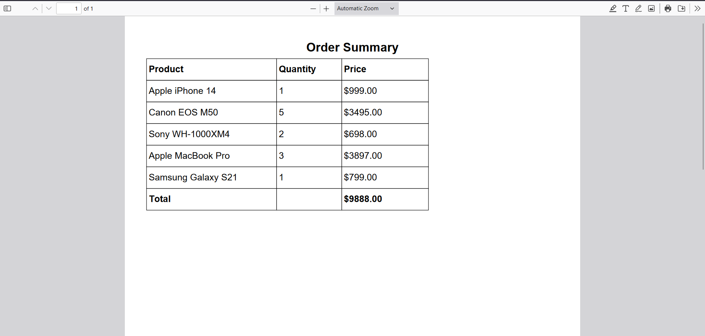

# AI-Powered E-Commerce Chatbot with Gemini 1.5 & Google API

This project is an advanced AI-powered E-commerce chatbot designed to assist users in shopping online. It dynamically manages a shopping cart, integrates with Google API, and utilizes the Gemini 1.5 model to understand and respond to user inputs. The chatbot also allows for PDF order summary generation and full interaction logging using Streamlit.

## Features

- **AI Chatbot with Gemini 1.5 Model:** Uses advanced NLP to assist users with product inquiries and manage shopping tasks.
- **Google API Integration:** Provides enhanced interaction capabilities using Google API.
- **Dynamic Cart Management:** Add, remove, or adjust quantities of products in the cart through natural language commands.
- **Product Display:** Displays product information with descriptions and images for easy browsing.
- **PDF Generation:** Generates a downloadable PDF order summary after users place their orders.
- **Interactive Chat Experience:** Session-based chat history and product suggestions based on user input.
- **Streamlit Interface:** Clean and responsive web interface for product interaction and chatbot communication.

## Tech Stack

- **Language:** Python 3.12+
- **Framework:** Streamlit
- **NLP Model:** Gemini 1.5
- **API:** Google API
- **PDF Generation:** FPDF

## How It Works

1. **Launching the Chatbot:**
   - Start the Streamlit app, which serves the interface.
   - Users can browse products and interact with the chatbot.
   
2. **Chatbot Interaction:**
   - Users can ask product-related questions, add products to their cart, and proceed with checkout through natural language commands. 
   - The chatbot supports various commands, including adding/removing items from the cart, showing cart contents, and proceeding with the order.

3. **Cart Management:**
   - Items are stored in a session-based cart, which keeps track of the quantity of each item.
   - Users can increase or decrease item quantities or remove items entirely.

4. **Order Summary & PDF Generation:**
   - Once the user confirms their order, the chatbot generates a PDF summarizing the order and provides a download link.

5. **NLP Commands:**
   - Add items: "Add 2 Apple iPhone 14."
   - Remove items: "Remove 1 Samsung Galaxy S21."
   - Show cart: "Show my cart."
   - Proceed to order: "Proceed with order."

## Installation

1. Clone the repository:

   ```bash
   git clone https://github.com/nitheesh2509/AI-E-Commerce-Chatbot-with-Gemini-1.5-Google-API-Cart-Management-PDF-Generation-via-Streamlit.git
   ```

2. Navigate to the project directory:

   ```bash
   cd https://github.com/nitheesh2509/AI-E-Commerce-Chatbot-with-Gemini-1.5-Google-API-Cart-Management-PDF-Generation-via-Streamlit.git
   ```

3. Install the dependencies:

   ```bash
   pip install -r requirements.txt
   ```

4. Run the Streamlit app:

   ```bash
   streamlit run streamlit_app.py
   ```

## Dependencies

- **Streamlit** - For building the web interface
- **FPDF** - For generating PDF order summaries
- **pandas** - Data handling and manipulation
- **Gemini 1.5 Model** - For NLP capabilities
- **Google API** - For enhanced functionalities

All required packages are listed in the `requirements.txt` file.

## Screenshots










## License

This project is licensed under the MIT License.

---

**Developed by [Nitheeshkumar R]**
